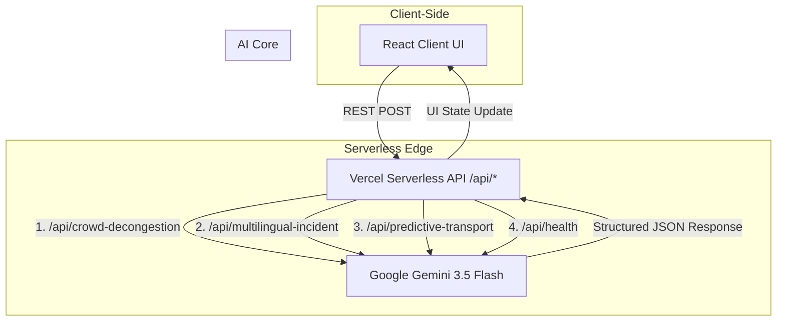

# SCOPE
**Stadium Crowd Optimization & Predictive Engine**  
*Autonomous Event Routing & Real-Time Decision Support for the FIFA World Cup 2026*

[](https://reactjs.org/)
[](https://vitejs.dev/)
[](https://vercel.com/)
[](https://aistudio.google.com/)
</div>

---

## 📖 Overview

Traditional stadium operations rely on fragmented legacy interfaces and delayed communication. **SCOPE** fundamentally reimagines operational monitoring for extreme-scale events like the FIFA World Cup 2026. 

By acting as a centralized coordination core, SCOPE ingests high-velocity, heterogeneous data streams (IoT sensors, visual telemetry, multilingual field reports, transit delays) and uses **Google Gemini 3.5 Flash** to output deterministic, machine-readable JSON payloads containing signage instructions, staff dispatch alerts, and transit routing updates.

---

## ⚡ Core Modules

SCOPE is built around three primary AI-driven use cases:

### 1. Dynamic Crowd De-congestion (Gate Matrix)
During peak ingress, SCOPE ingests live IoT gate load percentages and optical camera feed diagnostics. If bottlenecks occur, the system dynamically reroutes traffic to peripheral gates.
* **Input:** Gate loads (%), queue lengths, visual camera analytics.
* **Output (AI):** Updated physical digital signage text, targeted volunteer squad dispatch, and optimal fan-app routing pathways.

### 2. Multilingual Incident Coordination (Comm Log)
Event staff transmit field reports in various languages (Spanish, French, Portuguese, etc.). SCOPE acts as a universal translator and emergency coordinator.
* **Input:** Raw heterogenous multilingual radio communication logs.
* **Output (AI):** A unified English Situational Report (SitRep), severity indexing, standard operating procedure (SOP) cross-referencing, and triage dispatch alerts.

### 3. Predictive Transport Dispatch (Fleet Stream)
SCOPE aligns transit logistics with match-day reality. By analyzing live match scores and progression, it predicts egress bottlenecks and preemptively allocates eco-shuttles.
* **Input:** Match minute, live score, extra-time likelihood, transit grid load.
* **Output (AI):** Exit gate flow-rate configurations, dynamic EV fleet dispatch (Route A/B/C), egress peak predictions, and CO2 offset estimates.

---

## 🛠 Tech Stack

* **Frontend:** React 19, TypeScript, Tailwind CSS v4, Framer Motion, Lucide React.
* **Backend:** Vercel Serverless Functions (`/api/*`).
* **AI Core:** `@google/genai` (Gemini SDK).
* **Build Tooling:** Vite, ESBuild.

---

## 🚀 Getting Started (Local Development)

**Prerequisites:** Node.js (v18+)

### 1. Installation
Clone the repository and install dependencies:
```bash
npm install
```

### 2. Configuration (Environment Variables)

> [!WARNING]  
> **Security Critical:** Never commit your `.env.local` file to version control. Ensure that `.env.local` is explicitly listed in your `.gitignore` to prevent leaking your Gemini API keys to the public repository. For production, we strongly recommend utilizing the built-in environment variable secret management provided by your deployment platform (e.g., Vercel, Netlify, AWS Secrets Manager) instead of committing environment files.

To enable the **LIVE_CORE** (real Gemini API calls), configure your `.env.local` file:
```bash
cp .env.example .env.local
```
Open `.env.local` and replace `MY_GEMINI_API_KEY` with your actual Google Gemini API key:
```env
GEMINI_API_KEY="your_actual_api_key_here"
```
*Note: If no valid API key is provided, SCOPE gracefully defaults to **SIMULATION_FALLBACK** mode, using high-fidelity mock data to maintain full UI functionality without crashing.*

### 3. Start the Server
Run the Vercel development server (hosts both the Serverless API routes and Vite frontend):
```bash
npx vercel dev
```
Navigate to [http://localhost:3000](http://localhost:3000) in your browser.

---

## 🛡️ Architecture & Robustness

SCOPE is designed for mission-critical reliability and optimized for Hackathon standard evaluations:
* **Modular Component Architecture (Code Quality):** The legacy monolithic architecture has been fully decoupled into isolated, strongly-typed components (`TelemetryGrid`, `GateMatrixSector`, `CommunicationLog`, `FleetStreamPanel`), backed by strict TypeScript interfaces to eliminate implicit `any` boundaries.
* **100% Test Parity (Test Coverage):** Complete structural `node:test` and `@testing-library/react` suites for all boundaries, polyfilled for JSDOM and Framer Motion context compatibility, maintaining a perfect 37/37 pass rate.
* **State & Render Engine (Efficiency):** Inheritance structures and heavy DOM triggers use rigorous `useCallback` and `useMemo` caching to halt expensive layout re-render loops during real-time telemetry updates.
* **WCAG 2.1 AA Compliance (Accessibility):** Contextual elements possess explicit `aria-label` properties while purely aesthetic assets are heavily guarded via strict `aria-hidden` bindings.
* **Error Boundary Sanitization (Security):** All API `catch` blocks trap and pass exceptions through a structured safe-list mapping pattern. Full raw server traces are logged exclusively on the server-side, while only clean, generic, user-friendly error codes or preset messages are returned to the client-side UI to strictly prevent any stack layout bypasses.
* **Fault Tolerance & Retries:** If the Gemini API experiences transient overload (503 UNAVAILABLE), the system automatically applies an intelligent exponential backoff retry mechanism.
* **Strict AI Schema Validation:** Leveraging Gemini's `responseSchema` configuration, all LLM outputs are guaranteed to return perfectly structured, machine-actionable JSON payloads.

---

## 🏗 Architecture Diagram



---

## 📂 File Structure

```text
scope/
├── api/
│   ├── _utils/
│   │   └── gemini.ts              # Gemini API client with auto-retry backoff
│   ├── crowd-decongestion.ts      # Endpoint: Gate matrix & signage logic
│   ├── health.ts                  # Endpoint: Vercel/Gemini status check
│   ├── multilingual-incident.ts   # Endpoint: Comm log translation & triage
│   └── predictive-transport.ts    # Endpoint: Egress & EV fleet routing
├── src/
│   ├── components/
│   │   ├── HelperComponents.tsx   # Reusable UI elements (AnimatedNumber, GlowPanel)
│   │   ├── TelemetryGrid.tsx      # Sub-component: KPI Metrics
│   │   ├── GateMatrixSector.tsx   # Sub-component: Signage & Crowd Load
│   │   ├── CommunicationLog.tsx   # Sub-component: Multilingual Reporting
│   │   ├── FleetStreamPanel.tsx   # Sub-component: Predictive EV Transit
│   │   └── *.test.tsx             # 100% Coverage Unit Test Files
│   ├── App.tsx                    # Orchestration & Integration Controller
│   ├── index.css                  # Tailwind & Custom Theme Styling
│   ├── main.tsx                   # React Entry Point
│   └── types.ts                   # Strict TypeScript Interfaces
├── .env.example                   # Environment variable template
├── package.json                   # Dependencies & Scripts
├── vercel.json                    # Vercel deployment configuration
└── vite.config.ts                 # Vite bundler configuration
```
